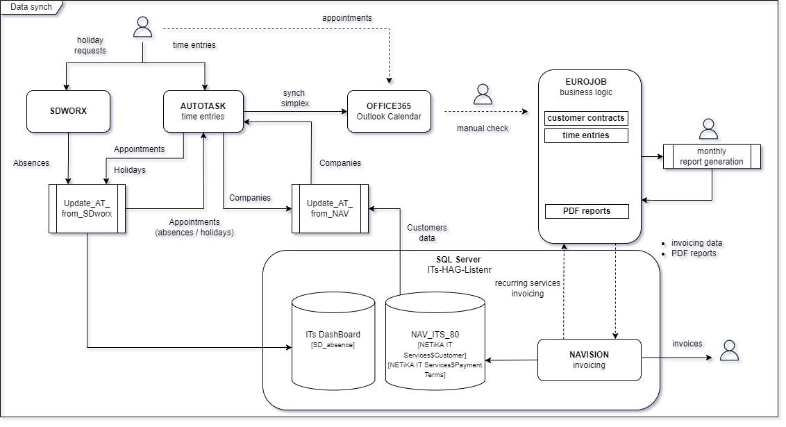
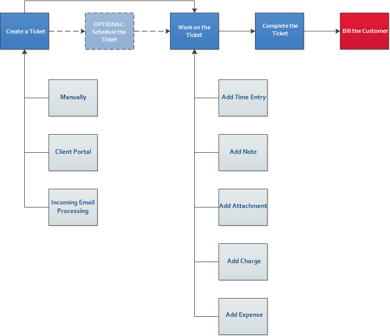
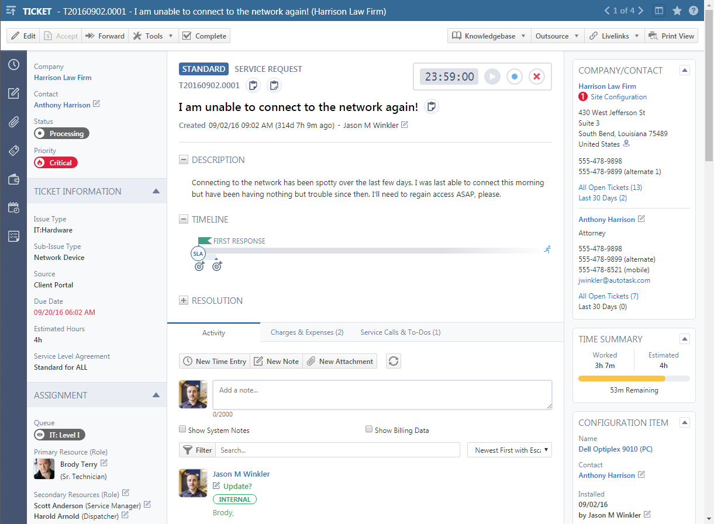
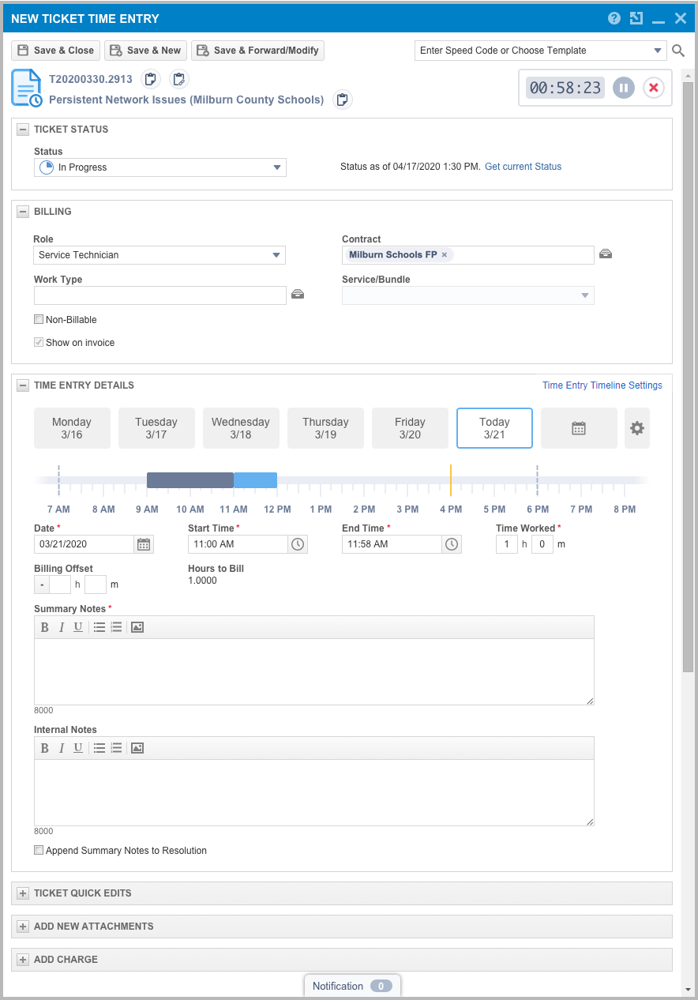

# Systèmes intégrés

Contractika s'inscrit dans un ensemble d'outils historiques et opérationnels.
Chaque système conserve un rôle précis dans la chaîne de données.

## AutoTask

AutoTask est la source principale pour l'opérationnel :

* clients et contrats ;
* employés et rôles ;
* tickets ;
* time entries ;
* appointments utilisés pour les absences.

Les techniciens y encodent leurs prestations. Chaque time entry est rattachée à
un ticket ou à une tâche. Contractika récupère ces données pour calculer les
points et produire les rapports.

## Navision

Navision est la source administrative et comptable :

* données client ;
* conditions de paiement ;
* prix du point ;
* factures et notes de crédit ;
* lignes de facturation récurrentes ou ponctuelles.

Les lignes Navision sont importées dans Contractika afin de créer les crédits
correspondants sur les Service Accounts.

## SDWorx

SDWorx est la référence RH pour les employés et les absences. Les absences
encodées dans SDWorx sont synchronisées avec Contractika puis matérialisées dans
AutoTask sous forme d'appointments lorsque les correspondances sont disponibles.

Certains codes d'absence sont explicitement ignorés, notamment les jours
travaillés, certains retours partiels et les jours fériés traités par une logique
spécifique.

## EuroJob

EuroJob est le système historique utilisé pour la gestion des contrats et la
production des rapports mensuels. Contractika reprend les règles métier utiles et
vise à supprimer les limitations historiques liées à EuroJob.

La documentation source conserve plusieurs références à EuroJob pour expliquer
l'origine des flux, des coefficients et des règles de facturation.

## Base SQL ITs DashBoard

La base SQL Server ITs DashBoard centralise historiquement des informations
issues de Navision, EuroJob, AutoTask et SDWorx. Elle est utilisée par certains
scripts et fichiers Excel pour lire ou écrire des données intermédiaires.
