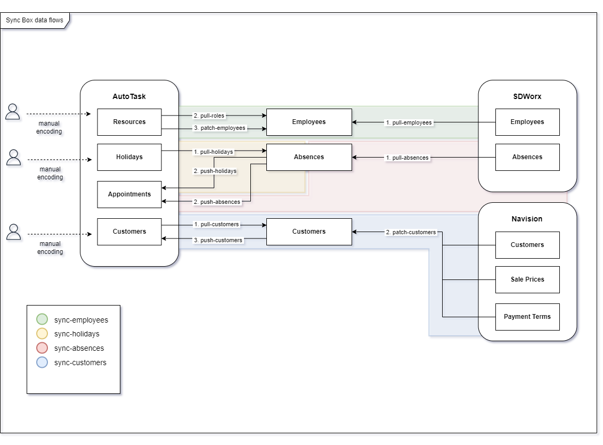

# Synchronisations

Contractika applique une stratégie de synchronisation découplée : les données
sont récupérées, enrichies, contrôlées puis propagées au moment approprié. Les
opérations ne doivent pas nécessairement s'exécuter simultanément.

## Principe général

AutoTask fournit les données opérationnelles de prestation. Navision complète les
données client et les lignes de facturation. SDWorx fournit les informations RH
nécessaires aux absences.

Contractika recoupe ces informations pour produire un modèle cohérent :

* employés et rôles ;
* clients ;
* contrats et Service Accounts ;
* absences ;
* time entries ;
* lignes de facturation ;
* alertes de cohérence.

## Synchronisation AutoTask et SDWorx

Les employés sont encodés dans AutoTask et possèdent une référence permettant de
les faire correspondre aux identifiants SDWorx. La documentation source indique
que le champ AutoTask `Payroll Identifier` contient par convention l'identifiant
employé SDWorx le plus récent.

Les traitements décrits sont :

* `pull-employees` : mise à jour des employés depuis SDWorx ;
* `pull-roles` : mise à jour des rôles depuis AutoTask ;
* `patch-employees` : enrichissement des employés avec les données AutoTask ;
* `update-holidays` : synchronisation des jours fériés ;
* `update-absences` : récupération des absences SDWorx ;
* `sync-holidays` : création des appointments AutoTask pour les jours fériés ;
* `sync-absences` : création, mise à jour ou suppression des appointments AutoTask pour les absences.

Si le contrat RH d'un employé change, son identifiant SDWorx peut changer. Tant
que la correspondance AutoTask n'est pas mise à jour, les absences concernées ne
peuvent pas être traitées correctement.

## Synchronisation AutoTask et Navision

Les clients sont d'abord récupérés depuis AutoTask, puis enrichis par Navision.
Les traitements décrits sont :

* `update-customers` : mise à jour des Customers depuis AutoTask ;
* `patch-customers` : enrichissement avec les données NAV.

Navision fournit notamment le numéro de TVA, les conditions de paiement, le prix
du point, le discount, la marge cible et l'état bloqué du client. Les fiches
client ne sont pas supprimées de Navision : un client inactif y est marqué comme
bloqué.

## Contrôles et alertes

Les synchronisations déclenchent des contrôles de cohérence. Lorsqu'une donnée
source empêche le traitement, Contractika crée une alerte liée à l'objet concerné
afin qu'une correction puisse être effectuée dans Contractika ou dans le système
source.
