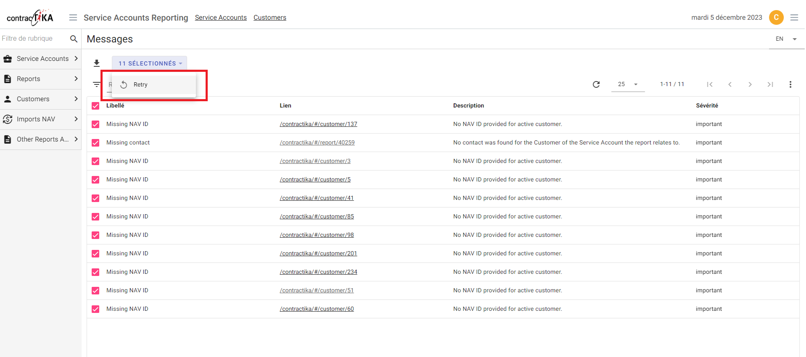

# Alertes

Contractika dispose d'un dashboard d'alertes pour suivre les incohérences qui
nécessitent une intervention.

## Principe

Les alertes affichées correspondent aux situations où une action est requise :
client sans identifiant NAV, contact manquant, Service Account sans client connu
ou échec d'envoi de report.

Le cycle de vie est le suivant :

* les synchronisations exécutent des tests de cohérence ;
* un test en échec crée une alerte liée à l'objet concerné ;
* un test redevenu valide supprime les alertes correspondantes ;
* chaque alerte permet d'accéder à l'objet concerné ;
* l'action `Retry` relance le test après correction ;
* l'action peut être exécutée sur une alerte individuelle ou en lot.

Les corrections peuvent devoir être faites dans Contractika ou dans le système
source, le plus souvent AutoTask ou Navision.

## Types d'alertes décrits

| Nom | Libellé | Type | Description |
|---|---|---|---|
| `contractika.report.missing_contact` | Missing contact | report | Aucun contact trouvé pour le client lié au report. |
| `contractika.customer.missing_contact` | Missing contact | customer | Aucun contact fourni pour un client actif. |
| `contractika.customer.missing_nav_id` | Missing NAV ID | customer | Aucun identifiant NAV fourni pour un client actif. |
| `contractika.customer.missing_identity` | Missing identity | customer | Aucune identité liée à la société AutoTask. |
| `contractika.customer.duplicate_vat` | Duplicate VAT | customer | Le numéro de TVA est déjà utilisé par un autre client. |
| `contractika.service_account.unknown_company` | Unknown Company | service_account | Le contrat référence un client inconnu. |
| `contractika.report.failed_email_sending` | Failed email sending | report | L'envoi email du report a échoué. |

## Objectif opérationnel

Le dashboard d'alertes doit idéalement rester vide. Les alertes servent donc de
file de travail pour corriger les données, relancer les tests et confirmer que
les synchronisations peuvent continuer sans erreur.
