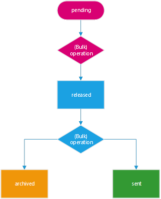

# Reports

Les reports sont les rapports périodiques produits par Contractika pour les
Service Accounts. Ils reprennent les lignes de prestation et servent à l'envoi,
à l'archivage ou au contrôle administratif.

## Création d'un report

La période d'un report commence le jour suivant la fin de la période couverte
par le report précédent. La date de fin correspond au dernier jour de la période
couverte.

Lorsqu'un nouveau client est créé par synchronisation, la date de départ du
reporting correspond au premier jour du mois de création du client. Cette valeur
peut ensuite être modifiée sur la fiche client.

La fréquence de reporting peut être définie globalement ou au niveau du client.
Les valeurs décrites incluent notamment `monthly`, `weekly` et `eurojob`.

## Génération automatique

Une tâche génère des brouillons de reports pour les Service Accounts éligibles,
en général en début de mois. Un report peut aussi être généré depuis la fiche du
Service Account.

Les conditions de génération décrites sont :

* client actif ;
* fréquence de reporting différente d'EuroJob ;
* contrat actif ;
* reporting du contrat différent de `None`.

## Workflow

Les reports passent par un état brouillon, puis par un état émis. Une fois
validés, ils peuvent être archivés automatiquement ou préparés pour envoi selon
la configuration du contrat.

Un report vide ou configuré pour archivage est archivé sans envoi. Un report
configuré pour envoi reste disponible pour confirmation individuelle ou par lot.

## Bonus Reports

Les Bonus Reports servent au contrôle des bonus des prestataires à partir des
points imputés aux clients. La documentation source présente ce rapport comme un
rapport trimestriel, mais décrit ensuite une période d'un mois. Ce point est
repris dans les éléments à confirmer.

## Cut-off Reports

Les Cut-off Reports présentent les balances des Service Accounts en points et en
valorisation comptable.

Un Cut-off Report couvre le premier mois non encore publié depuis la date de
départ retenue. Il ne peut être publié que si sa période est terminée et si tous
les reports nécessaires sont finalisés. Lorsqu'il référence un report manquant ou
encore en brouillon, le champ `has_pending_report` empêche sa validation.
